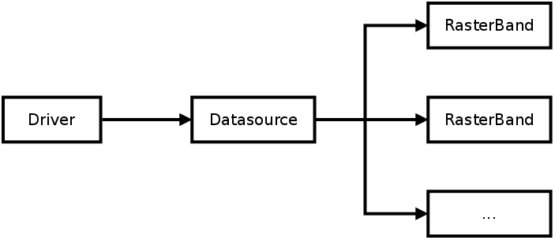

====================
Rastrová data - GDAL
====================

Pro práci s rastrovými geodaty se „tradičně“ používá knihovna GDAL. Knihovna GDAL je nízkoúrovňová, přistupuje k datům pokud možno efektivním způsobem. V současnosti knihovna GDAL podporuje více než 140 rastrových GIS formátů.
Datový model

Koncept pro rastrová data do značné míry odpovídá přístupu k vektorovým datům:

    **Driver**
        ovladač pro čtení a zápis dat
    **Datasource**
        zdroj dat, ze kterého a do kterého se čte a zapisuje
    **RasterBand**
        rastrový kanál. U něterých zdrojů dat je jenom jedno pásmo, ale může jich mít teoreticky neomezeně (např. u hyperspektrálních dat).

Rastrový datový model
---------------------

Dataset
^^^^^^^
Soubor kanálů rastrového datového zdroje a některých vlastností, které mají společné

* Velikost rastru (počet pixelů)
* Georeferencing
* Metadata

Souřadnicový systém (Coordinate system)
^^^^^^^^^^^^^^^^^^^^^^^^^^^^^^^^^^^^^^^
Reprezentován jako OpenGIS Well Known Text (WKT).

Metadata
^^^^^^^^

Páry klíč-hodnota. 

Subdataset
^^^^^^^^^^
Seznam podřízených datasetů. Většinou seznam kanálů nebo obrázků uložených v jednom datovém zdroji.

Rastrový kanál (Raster band)
^^^^^^^^^^^^^^^^^^^^^^^^^^^^
Band/channel/layer - kanál, vrstva. Například kanály R, G, B, NIR, ...

        * Výška a šířka v pixelech
        * Datový typ (Byte, UInt16, Int16, UInt32, Int32, UInt64, Int64, Float32, Float64, ...)
        * Velikost bloku
        * Metadata, popis
        * NODATA_VALUES
        * `STATISICS_*`
        * Tabulka barev
        * ...

Přehledy (Overviews)
^^^^^^^^^^^^^^^^^^^^
Každý přehled je prepresentován jedním `Kanálem`. Jeho velikost bude různá - v závislosti na rozlišení pixelu. 

Podporované formáty
-------------------
GDAL podporuje více než `170 rastrových formátů <https://gdal.org/drivers/raster/index.html>`_. Ne všechny jsou zakompilované do verze knihovny na vašem počítači (běžně je nainstalována podpora pro cca 150 formátů).

Spolu s knihovnou se nainstaluje do systému celá řada užitečných programů, některé z nich proberem podrobněji. Jejich úplný seznam najdete na `https://gdal.org/programs/index.html <https://gdal.org/programs/index.html>`_

.. toctree::
   :maxdepth: 2

   gdalinfo
   gdalwarp
   gdal_translate
   gdaladdo
   gdaltindex
   gdal_contour
   gdaldem
   gdal_merge
   gdalmanage
   gtiff
   vrt
   wms
   virtual_filesystems
